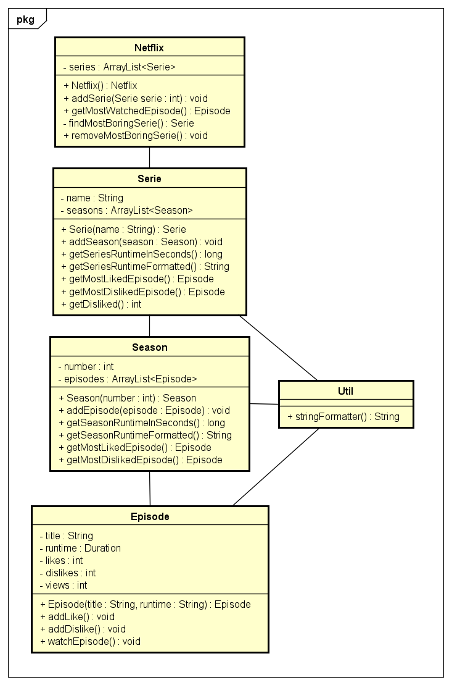

# Startdocument for Netflix assignment

Startdocument of **Aggrey Odera Okero, Student Number **4815440**. 

### Problem Description

Netflix wants a new simple application for the users to watch series. A series is divided into multiple seasons and every season has at least one episode. The application should have the following features:

- Make a netflix hub that holds all the series;
- Make a method for the user to start watching an episode;
- Make a method for the user to rate the episode (Thumbs Up/Thumbs Down);
- Show the duration of an episode in complete time hh:mm:ss;
- Make a method to show the most interesting and the most boring episode per serie.
- Additionally, a method to remove the series with the biggest amount of boring episode can be made.

### Input & Output

In this section of the document the in- and output of the application will be described

**Input**

| Case            | Type       | Conditions                      |
| --------------- | ---------- | ------------------------------- |
| Episode Name    | `String`   | not empty                       |
| Episode Runtime | `Duration` | Provided as `String` in minutes |
| Series Name     | `String`   | not empty                       |

**Calculation**

| Case               | Input | Output                                                       |
| ------------------ | ----- | ------------------------------------------------------------ |
| Add Like/Dislike   | none  | Increase the like/dislike count by 1                         |
| Watch Episode      | none  | Increase the views count by 1                                |
| Get season runtime | none  | Parse all the `Episode` object instances and add their runtimes to a total count |
| Get series runtime | none  | Parse all the `Serie` object instances and add their runtimes to a total count, make use of previous method |

**Output**

| Case                     | Type                 |
| ------------------------ | -------------------- |
| Series                   | `ArrayList<Serie>`   |
| Seasons in Serie         | `ArrayList<Season>`  |
| Episodes in Season       | `ArrayList<Episode>` |
| Episode                  | `Episode`            |
| Most Interesting Episode | `Episode`            |
| Most Boring Episode      | `Episode`            |
| Season Runtime           | `Duration`           |
| Serie Runtime            | `Duration`           |
| Most Watched Episode     | `Episode`            |

**Remarks**

- Input will be validated;
- Only the most upper class will contain System.out.println.

### Class Diagram

### Test plan.

In this section the testcases that will be used to test the functionality of the application will be described.

**Testcase Data Creation -  Verify Serie, Season and Episode Creation**

Note: All testcases are dependent on this test case.

| Step | Input                                                        | Action                                                       | Expected output                |
| ---- | ------------------------------------------------------------ | ------------------------------------------------------------ | ------------------------------ |
| 1    | money heist 58                                          | `Episode episode1 = new Episode("Pilot","58");`              | New episode created and listed |
| 2    | Cat's in the bag, 48 Silicon Valley, 48 Seven Thirty-Seven, 47 | `Episode episode2 = new Episode("Cat's in the bag", "48");` `Episode episode3  = new Episode("And the bag's in the river", "48");` `Episode episode4 = new Episode ("Seven Thirty-Seven", "47");` | More episodes created          |
| 3    | 1, 2                                                         | `Season season1 = new Season(1);` `Season season2 = new Season(2);` | Two seasons created            |
| 4    | episode1, episode2, episode 3, episode4                      | `season1.addEpisode(episode1);` `season1.addEpisode(episode2);` `season1.addEpisode(episode3);` `season2.addEpisode(episode4);`  | New season added to the serie  |
| 5    | Nw amsterdam                                                 | `Serie breakingBad = new Serie("Breaking Bad");`             | New Serie created              |
| 6    | season1, season2                                             | `breakingBad.addSeason(season1);` `breakingBad.addSeaon(season2);` | Seasons added to the serie     |

**Testcase #1 Get Runtimes**

Season 1 has 3 episodes, one 58 minutes and two 48, while season 2 has a single episode of 47 minutes.

| Step | Input | Action                       | Expected output |
| ---- | ----- | ---------------------------- | --------------- |
| 1    |       | `season1.getSeasonRuntime()` | 154             |
| 2    |       | `getSeriesRuntime()`         | 201             |

**Testcase #2 Get Most (Liked/Disliked) Episode from Serie**

First the add like and dislike feature is tested.

| Step | Input | Action                                 | Expected output           |
| ---- | ----- | -------------------------------------- | ------------------------- |
| 1    |       | `episode1.addLike` x2                  | Episode 1 gets 2 likes    |
| 2    |       | `episode2.addLike`                     | Episode 2 gets 1 like     |
| 3    |       | `episode3.addDislike` x2               | Episode 3 gets 2 dislikes |
| 4    |       | `episode4.addDislike`                  | Episode 4 gets 1 dislike  |
| 5    |       | `breakingBad.getMostLikedEpisode()`    | `episode1`                |
| 6    |       | `breakingBad.getMostDislikedEpisode()` | `episode3`                |

**Testcase #3 Remove Most Boring Serie**

These methods work inside the Netlfix class. For this test a new series is created with a single episode with 10 dislikes. 

| Step | Input                   | Action                                                       | Expected output                                              |
| ---- | ----------------------- | ------------------------------------------------------------ | ------------------------------------------------------------ |
| 1    | Create a new test serie | `Episode episode6 = new Episode("The Iron Throne","80");` `Season season8 = new Season(8);` `Serie gameOfThrones = new Serie("Game of Thrones");` `gameOfThrones.addSeason(season8);` `season8.addEpisode(episode6);` | Created a new serial, Game of Thrones, with one episode in one season |
| 2    |                         | `episode6.addDislike` x10                                    | Disliked episode 6 10 times                                  |
| 1    |                         | `removeMostBoringSerie()`                                    | In the netflix class, search for the series with most dislikes and remove it => remove Game of Thrones |
| 2    |                         | `getSeries()`                                                | `ArrayList<Serie> serie` does not contain the Game of Thrones anymore |

